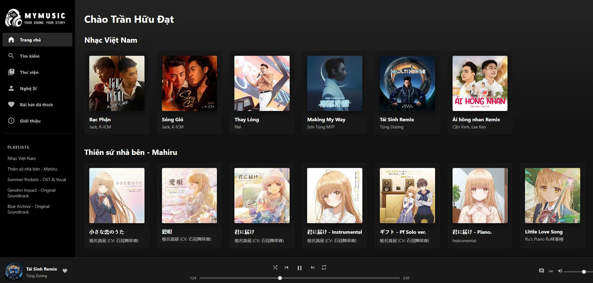
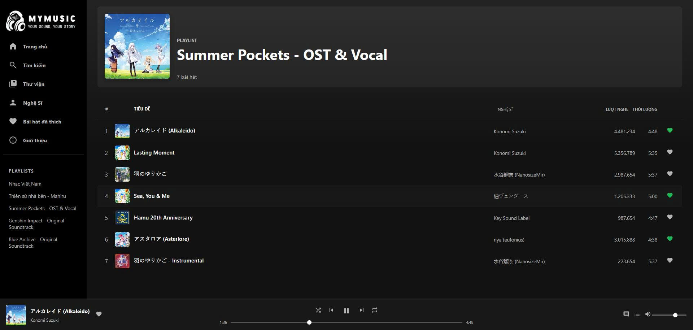
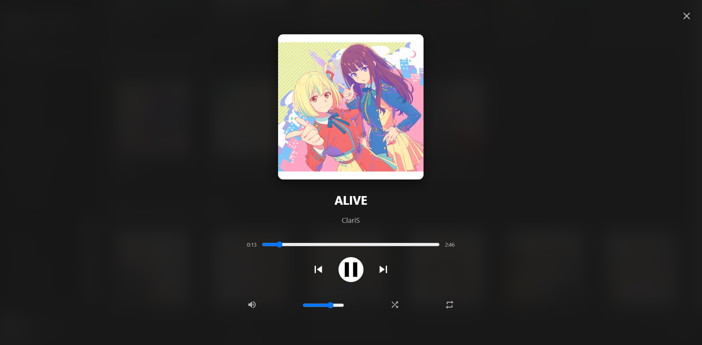
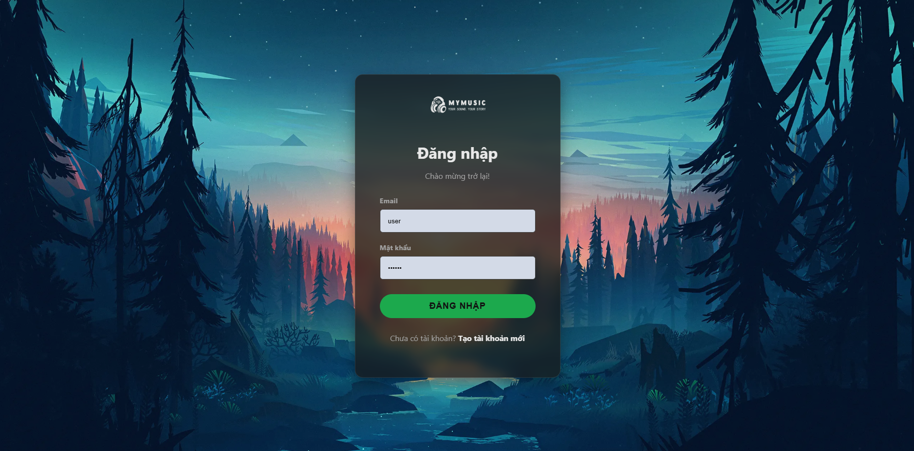
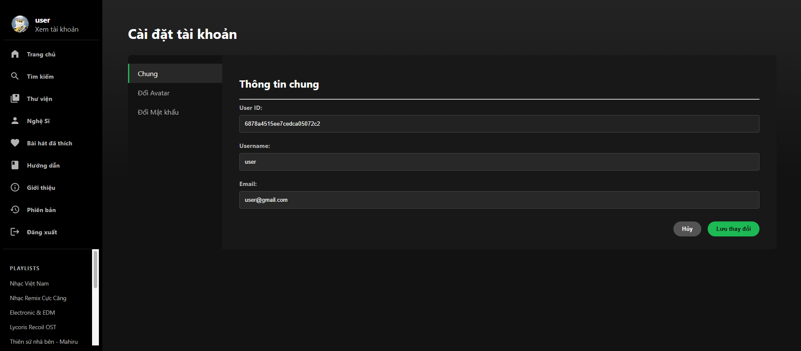
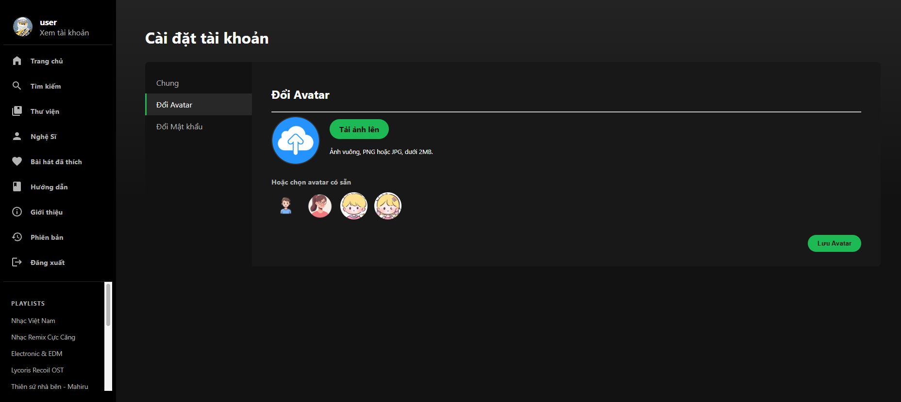

<div align="center">

# MyMusic Player v2.0.0

<p align="center">
  
</p>

<p align="center">
  <strong>A modern, full-stack web-based music player built with Node.js, Express, MongoDB, and EJS.</strong>
</p>

<p align="center">
  <a href="https://github.com/TranHuuDat2004/mymusic/stargazers"></a>
  <a href="https://github.com/TranHuuDat2004/mymusic/network/members"></a>
  <a href="https://github.com/TranHuuDat2004/mymusic/issues"></a>
  <!-- <a href="https://github.com/TranHuuDat2004/mymusic/blob/main/LICENSE"></a> -->
</p>

<p align="center">
  <a href="https://mymusic-ahw7.onrender.com/" target="_blank">
    
  </a>
  <a href="https://github.com/TranHuuDat2004/mymusic/releases/latest" target="_blank">
    
  </a>
</p>

</div>

---

**MyMusic Player** is a full-stack web application that serves as a modern online music player with an interface inspired by popular platforms like Spotify. This project is a proof-of-concept for building a complete web application from scratch, including a backend, database, API, and user authentication system.

## ✨ Key Features

### For All Visitors
- **Modern & Responsive UI:** A clean, intuitive interface that works smoothly on both desktop and mobile devices.
- **Full-Featured Music Player:** Includes play/pause, progress bar, volume control, shuffle, repeat modes, and a synchronized fullscreen "Now Playing" view.
- **Native OS Integration:** Utilizes the Media Session API for lock screen and hardware media controls.
- **Dynamic Content:** Browse dynamically-loaded playlists, artists, and song libraries fetched from the server.

### For Registered Users
- **Secure Authentication:** User registration and login system with server-side password hashing (bcrypt) and JWT-based session management.
- **Personalization:**
  - **Liked Songs:** Save your favorite tracks to a personal collection.
  - **Account Settings:** Update your profile info, change your password, and upload a custom avatar.
- **Dynamic Interactions:** Liking songs and other personalized actions are handled instantly via API calls without page reloads.

---

## 🛠️ Technology Stack

| Area           | Technologies                              |
| :------------- | :---------------------------------------- |
| **Backend**    | Node.js, Express.js                       |
| **Database**   | MongoDB (with Mongoose ODM)               |
| **Frontend**   | HTML5, CSS3, JavaScript (ES6+)            |
| **View Engine**| EJS (Embedded JavaScript templating)      |
| **Authentication** | JSON Web Tokens (JWT), bcrypt.js      |
| **File Uploads** | Multer                                    |
| **Environment**| dotenv, nodemon                           |

---

## 🖼️ Screenshots

| Homepage | Playlist / Artist Page | Fullscreen Player |
| :---: | :---: | :---: |
|  |  |  |
| **Login Page** | **Account Settings** | **Change Avatar** |
|  |  |  |


---

## 🚀 Getting Started

<details>
<summary><strong>Click to view installation guide</strong></summary>
<br>

To run this project on your local machine, follow these steps.

### Prerequisites

- [Node.js](https://nodejs.org/) (v16.x or later)
- [MongoDB](https://www.mongodb.com/try/download/community) (local installation) or a [MongoDB Atlas](https://www.mongodb.com/cloud/atlas) account (recommended)

### Installation

1.  **Clone the repository:**
    ```bash
    git clone https://github.com/TranHuuDat2004/mymusic.git
    cd mymusic
    ```

2.  **Install backend dependencies:**
    ```bash
    cd backend
    npm install
    ```

3.  **Create a `.env` file** in the `backend` directory and add the following:
    ```env
    PORT=5001
    MONGO_URI=your_mongodb_connection_string
    JWT_SECRET=your_super_secret_jwt_key
    ```
    - Replace the placeholder values with your actual configuration.

4.  **Import initial data (Optional):**
    ```bash
    node backend/importData.js
    ```

5.  **Start the server:**
    ```bash
    npm run dev
    ```

6.  Open your browser and navigate to `http://localhost:5001`.

</details>

---

## 🤝 Contributing

Contributions are welcome! If you'd like to contribute to the project, please fork the repository and create a Pull Request.

1.  Fork the Project
2.  Create your Feature Branch (`git checkout -b feature/AmazingFeature`)
3.  Commit your Changes (`git commit -m 'Add some AmazingFeature'`)
4.  Push to the Branch (`git push origin feature/AmazingFeature`)
5.  Open a Pull Request

## 📄 License

This work is licensed under a [Creative Commons Attribution-NonCommercial 4.0 International License](http://creativecommons.org/licenses/by-nc/4.0/).

## 🧑‍💻 Developer

This project was developed by **Trần Hữu Đạt**.

*   **GitHub:** [@TranHuuDat2004](https://github.com/TranHuuDat2004)
*   **Portfolio:** [tranhuudat2004.github.io](https://tranhuudat2004.github.io/)

---

<p align="center">
  Thank you for checking out MyMusic Player!
</p>
